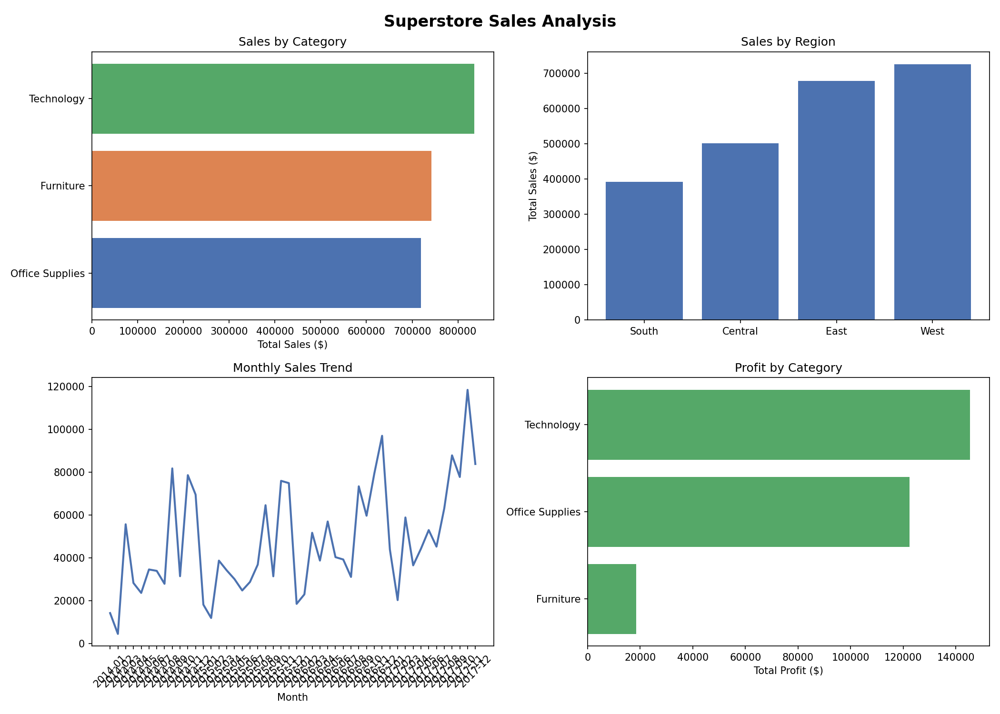

# Retail Sales Dashboard

An end-to-end data analytics project analysing retail sales data using Python and Power BI.

## Project Overview

Cleaned and analysed a 9,994-row retail dataset to uncover sales trends, regional performance, and product profitability. Built an interactive Power BI dashboard to present findings to stakeholders.

## Tools Used

- **Python** — data cleaning and analysis
- **Pandas** — data manipulation
- **Matplotlib** — data visualisation
- **Power BI** — interactive dashboard

## Key Insights

- Total revenue of $2.3M with a 12.5% profit margin
- Technology is the top-performing category by both sales and profit
- Furniture has high sales but the lowest profit margin — a hidden underperformer
- The West region leads in sales; the South is the weakest market
- Sales show consistent year-on-year growth with a seasonal spike at year end

## Project Structure
```
retail-sales-dashboard/
├── clean.py              # Data cleaning script
├── analysis.py           # Analysis script
├── charts.py             # Chart generation script
├── sales_charts.png      # Exported charts
└── Sales_Dashboard.pbix  # Power BI dashboard
```

## Dashboard Preview

